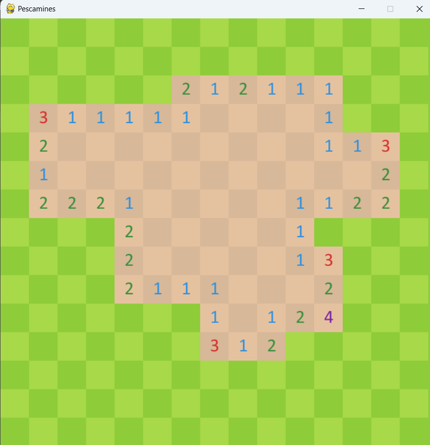
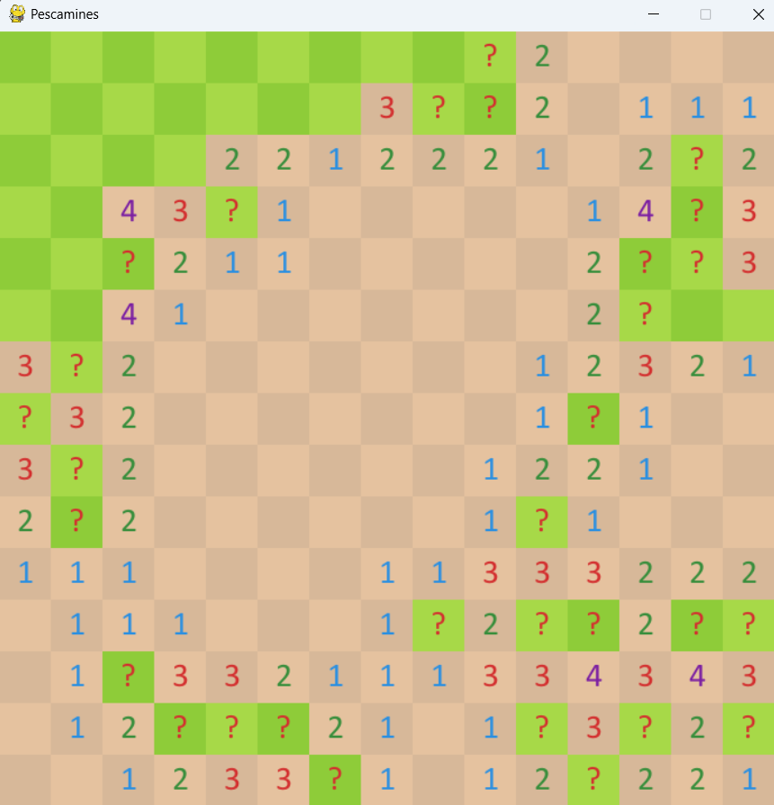

# Pygame-minesweeper
A script of the game minesweeper developed with pygame based on Google minesweeper interface

## Instructions
- Insert the font path on the script
- Run the code and select difficulty (board size)

